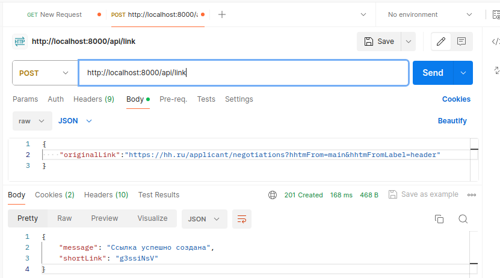
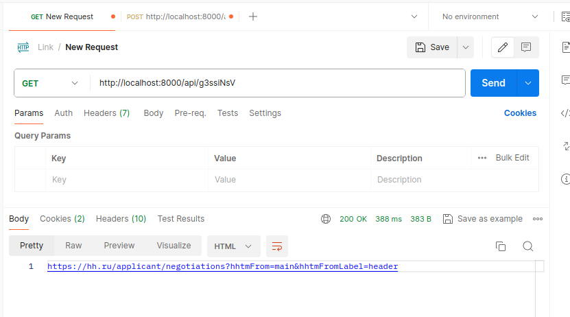

 <h1 align="center">Cервис сокращения ссылок ShortLinks</h1>
  <p> Этот проект реализован с помощью PHP 8.0 , фреймворка Laravel, PostgreSql и Nginx.
 <h2>Описание:</h2>
  <p> 
    Это сервис, в котором можно позволяющий пользователям создавать короткие ссылки и перенаправлять по ним на оригинальные адреса.<br />
    Для создания таблицы ссылок в базе данных использованы миграции Laravel<br />
    Для работы с данными примены Eloquent ORM <br />
    Для генерации коротких ссылок использована встроенные PHP функции Str::random()<br />
    Для проверки входных данных на валидность URL использована встроенные PHP функции Facades\Validator<br />
  </p>

<h2>Функционал сервиса:</h2>
<ul>

- Создание коротких ссылок
- Перенаправление по коротким ссылкам на оригинальные адреса

</ul>

<h2>API:</h2>
<ul>

- GET api/{shortLink} - Перенаправление на оригинальный URL, соответствующий сокращенной ссылке.
- POST api/link - Создание короткого URL.

</ul>

<h2>Примеры: </h2>
<ul>

1 Создание сокращенной ссылки:
- Метод: POST
- Endpoint: http://localhost:8000/api/link
- Входные данные: Оригинальный URL - https://hh.ru/applicant/negotiations?hhtmFrom=main&hhtmFromLabel=header
- Выходные данные: JSON с коротким URL. - g3ssiNsV



2 Редирект по сокращенной ссылке:
- Метод: GET
- Endpoint: http://localhost:8000/api/g3ssiNsV
- Действие: Перенаправление на оригинальный URL - https://hh.ru/applicant/negotiations?hhtmFrom=main&hhtmFromLabel=header, соответствующий сокращенной ссылке - g3ssiNsV.


</ul>
<h2>
    Чтобы запустить проект, выполните:
</h2>

Поднять проект:

```make dev-up```
